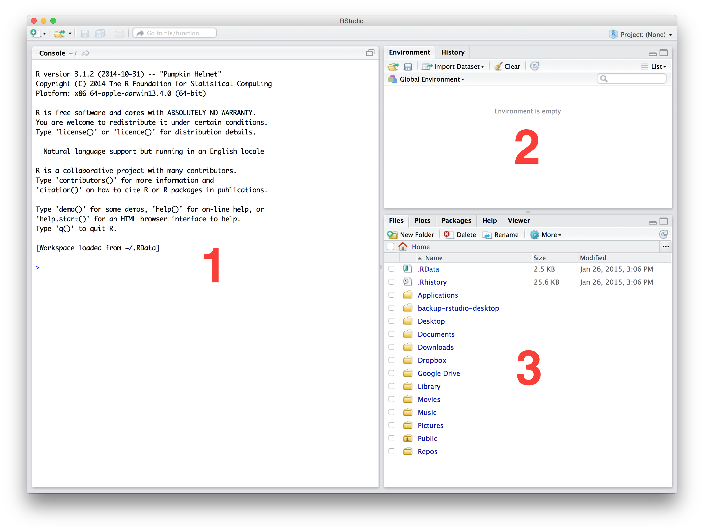

# Get up and running {-}

This book provides a self-contained introduction to how to use R for exploratory data analysis. Think of it as a resource that can be referred to when needed. There is certainly no need to memorise everything in this book. Instead, aim to understand the key concepts and familiarise yourself with the content so you know where to look for information when needed. The details will get easier with practise.

## Conventions in the course book

#### Text, instructions, and explanations {-}

Normal text, instructions, explanations etc. are written in the same type as this document, we will tend to use bold for emphasis and italics to highlight specific technical terms when they are first introduced (italics will also crop up with Latin names from time to time, but this is unlikely to produce too much confusion!)

At various points in the text you will come across text in different coloured boxes. These are designed to highlight stand-alone exercises or little pieces of supplementary information that might otherwise break the flow. There are three different kinds of boxes:

::: {.infobox .action data-latex="{action}"}
#### Action! {-}
This is an **action** box. We use these when we want you to do something. Do not ignore these boxes.
:::

::: {.infobox .information data-latex="{information}"}
#### Information! {-}
This is an **information** box. These aim to offer a discussion of why something works the way it does.
:::

::: {.infobox .warning data-latex="{warning}"}
#### Warning! {-}
This is a **warning** box. These usually highlight a common 'gotcha' that might trip up new users.
:::

#### R code and output in this book {-}

We  try to illustrate as many ideas as we can using snippets of real R code. It's a good idea to run these when working through a topic. The best way to learn something is to use it. Of course, in order to do that we need to know what we're looking at... Stand alone snippets will be formatted like this:

```{r}
tmp <- 1
print(tmp)
```

At this point it does not matter what the above actually means. You just need to understand how the formatting of R code in this book works. The lines that start with `## ` show us what R prints to the screen after it evaluates an instruction and does whatever was asked of it, that is, they show the output. The lines that __do not__ start with `## ` show us the instructions, that is, they show us the input. So remember, the absence of `## ` shows us what we are asking R to do, otherwise we are looking at something R prints in response to these instructions.

`This typeface` is used to distinguish R code within a sentence of text: e.g. "We use the `mutate` function to change or add new variables."

A sequence of selections from an RStudio menu is indicated as follows: e.g. **File ▶ New File ▶ R Script**

File names referred to in general text are given in upper case in the normal typeface: e.g. MYFILE.CSV.

## Different ways to run RStudio

COMPLETE ME

## Installing R and RStudio locally

COMPLETE ME

### Installing R

R is open source, meaning anyone can download the source code -- the collection of computer instructions that define R -- and assuming they have enough time, energy and expertise, they are free to alter it as they please. Open source does not _necessarily_ mean free, as in it costs £0 to download and use, but luckily R _is_ free in this sense. If you're working on the University managed desktops it should already have been installed and is ready for you to use. We encourage you to install a copy on your own laptop so that you can work at home, in the library, at a café, or wherever else you find you are productive. Do not use R on its own though. Use it in combination with the RStudio IDE discussed in the next section. 

In order to install R you need to download the appropriate installer from the Comprehensive R Archive Network ([CRAN](http://cran.r-project.org)). We are going to use the "base distribution" as this contains everything you need to use R under normal circumstances. There is a single [installer](http://cran.r-project.org/bin/windows/base/) for Windows. On a Mac, it's important to match the [installer](http://cran.r-project.org/bin/macosx/) to the version of OS X. In either case, R uses a the standard install mechanism that should be familiar to anyone who has installed an application on their machine. There is no need to change the default settings---doing so will probably lead to problems later on.

After installing R it should be visible in the Programs menu on a Windows computer or in the Applications folder on a Mac. However, it would be a good idea to read the next section before launching R...

### Installing RStudio {-}

RStudio is developed and maintained by a for-profit company called... RStudio. The basic desktop version of RStudio is free to download and use. It can be downloaded from the RStudio [download page](http://www.rstudio.com/products/RStudio/#Desk). The one to go for is the Open Source Edition of RStudio Desktop, __not__ the commercial version of RStudio Desktop. RStudio installs like any other piece of software---just run the installer and follow the instructions. There's no need to configure after after installation.

## The anatomy of RStudio

Once installed RStudio runs like any other stand-alone application, e.g. via the Programs menu or the Applications folder on a Windows PC or Mac, respectively. We'll say this one last time---RStudio will only work if R is also installed. Here is how RStudio appears the first time it runs on a Mac:

```{r, echo=FALSE}

```

There are three panes inside a single window, which we have labelled with red numbers. Each of these has a well-defined purpose. Let's take a quick look at these:

1. The large window on the left is the Console. We have already told you what this is for---the Console lets you know what R is doing and provides a mechanism to interact with R by typing instructions. All this happens at the prompt, `> `. You will be working in the Console in the next chapter so we won't say any more about this here.

2. The window at the top right contains two tabs. The first of these, labelled __Environment__, allows us to see all the different R objects we can access. There are also some buttons that help us to get data into and out of R. The second, labelled __History__, allows us to see a list of instructions we've previously sent to R. The buttons in this tab allow us to reuse or save these instructions.

3. The window at the bottom right contains five tabs. The first, labelled __Files__, gives us a way to interact with the files and folders. The next tab, labelled __Plots__, is where any figures we produce are displayed. This tab also allows you to save your figures to file. The __Packages__ tab is where we view, install and update packages used to extend the functionality of R. The __Help__ tab is where you can access and display various different help pages. The __Viewer__ is essentially an embedded web browser for working with interactive output---we won't be using it in this course.

Don't be alarmed if RStudio looks different on your computer. There are a couple of reasons why this might be the case. First, the appearance of RStudio is highly customisable. Take a quick look at the `Tools > Global Options...` window to see what we mean. Second, there is a fourth window that is sometimes be visible when we work with RStudio---the source code Editor we mentioned above. RStudio saves its state between different sessions, so if we have already messed about with RStudio's appearance or left a script open last time we used it you will see these changes.

::: {.infobox .warning data-latex="{warning}"}
#### RStudio will change over time {-}
Keep in mind that RStudio is very actively developed, which means features tend to appear or change over time. Consequently, if you update it regularly expect the odd thing to change here and there. This is generally a good thing---it usually means new features have been added---but it does require you to occasionally adjust to new additions.
:::


## Working at the Console in RStudio {#working-at-console}

R was designed to be used interactively---it is what is known as an **interpreted language**, which we can interact with via something called a Command Line Interface (CLI). This is just a fancy way of saying that we can type an instructions to "do something" directly into the Console and those instructions will then be interpreted when we hit the Enter key. If our R expression does not contain any errors, R will then do something like read in some data, perform a calculation, make a figure, and so on. What actually happens obviously depends on what we ask it to do.

Let's briefly see what all this means by doing something very simple with R. Type `1 + 3` at the Console and hit the Enter key:

```{r}
1+3
```

The first line above just reminds us what we typed into the Console. The line after that beginning with `## ` shows us what R printed to the Console after reading and evaluating our instructions. 

What just happened? We can ignore the `[1]` bit for now (the meaning of this will become clear later in the course). What are we left with -- the number 2. The instruction we gave R was in effect "evaluate the expression `1 + 3`". R read this in, decided it was a valid R expression, evaluated the expression, and then printed the result to the Console for us. Unsurprisingly, the expression `1 + 3` is a request to add the numbers 1 and 3, and so R prints the number 4 to the Console.

OK, that was not very exciting. In the next chapter we will start learning to use R to carry out more useful calculations. The important take-away from this is that this sequence of events---reading instructions, evaluating those instructions and printing their output---happens every time we type or paste something into the Console and hit Enter. The printing bit is optional by the way. Whether or not it happens depends on whether you decide to capture the output or not. Just remember, if R does not print anything to the Console it does not necessarily mean nothing has happened.

::: {.infobox .information data-latex="{information}"}
#### What does that word 'expression' mean? {-}

Why do we keep using that word _expression_? It has a very specific meaning in computer science. The [Wikipedia page](http://en.wikipedia.org/wiki/Expression_(computer_science)) says:

> An expression in a programming language is a combination of explicit values, constants, variables, operators, and functions that are interpreted according to the particular rules of precedence and of association for a particular programming language, which computes and then produces another value.

That probably doesn't make much sense but it does at least demonstrates why we don't let computer scientists teach biologists about programming! In simple terms, an R expression is a small set of instructions that tell R to do something. That’s it. We could write "instructions" instead of "expressions" throughout this book but we may as well use the correct word. Whatever we call them, our aim is to learn how to combine sequences of expressions to Get Things Done in R. That's what this book is about.
:::

## Working with **learnr** tutorials

COMPLETE ME
