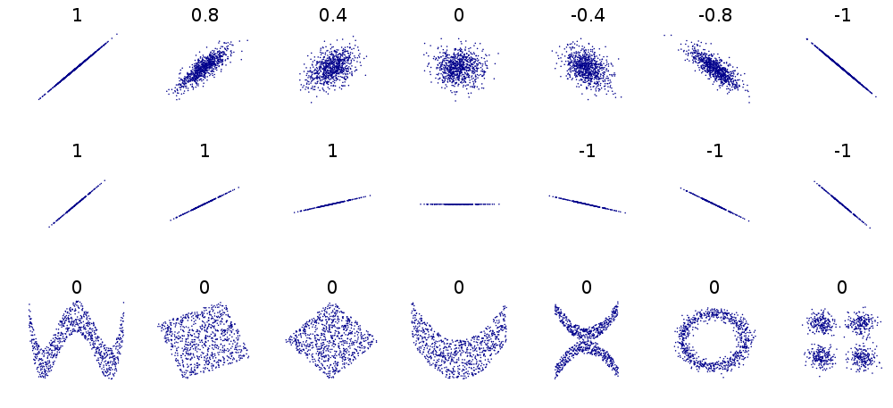

# Exploratory data analysis

## Introduction

Exploratory data analysis (EDA) was promoted by the statistician John Tukey in his 1977 book, "Exploratory Data Analysis". The broad goal of EDA is to help us formulate and refine hypotheses that lead to informative analyses or further data collection. The core objectives of EDA are:

-   to suggest hypotheses about the causes of observed phenomena,

-   to guide the selection of appropriate statistical tools and techniques,

-   to assess the assumptions on which statistical analysis will be based,

-   to provide a foundation for further data collection.

EDA involves a mix of numerical and visual methods of analysis. Statistical methods are sometimes used to supplement EDA. However, the main purpose of EDA is to facilitate understanding before diving into formal statistical modelling. Even if we think we already know what kind of analysis we need to pursue, it's always a good idea to **explore a data set before diving into the analysis**. At the very least, this will help determine whether or not our plans are sensible. Very often, it uncovers new patterns and insights.

In this chapter, we're going to examine some basic concepts that underpin EDA:

1.  classifying different **types of variables**, and
2.  distinguishing between **populations and samples**.

This will set us up to learn how to explore our data in later chapters.

## Statistical variables and data {#variables}

In the [Data frames](#chapter-data-frames) chapter, we pointed out that the word 'variable' can mean one of two things. In the context of programming, a variable is a name-value association that we create when we run some code. Statisticians use the word in a different way. To them, a variable is any characteristic or quantity that can be measured, classified or experimentally controlled. Much of statistics is about quantifying and explaining the variation in such quantities as best we can.

Species richness, relative abundance, infection status, enzyme activity, gene frequency, and blood glucose concentration are all examples of statistical variables we encounter in the biological sciences. These as statistical variables because their values vary between different observations. For example, 'annual fitness'---measured as the number of offspring produced---is a variable that differs both among the organisms in a population and over the life cycle of a given individual.

There are different ways to describe statistical variables according to the manner in which they can be analysed, measured, or presented. It's important to be clear about what kind of variables we're dealing with because this determines how we should visualise the data, and later, how we might analyse it statistically. There are many different ways to go about classifying variables. However, we only need to be aware of two fairly simple classification schemes in this book: numeric vs categorical variables and ratio vs interval scales (for numeric variables only).

### Numeric vs categorical variables

**Numeric variables** have values that describe a measurable quantity as a number, like 'how many' or 'how much'. Numeric variables are also called quantitative variables; the data collected containing numeric variables are called quantitative data. Numeric variables may be further described as either continuous or discrete:

-   **Continuous numeric variable**: Observations can take any value in a set of real numbers, i.e. numbers represented with decimals. This set is typically either 'every possible number' (e.g. the change in protein concentration can be positive or negative, and very large or very small) or 'all the positive numbers' (e.g. protein concentration may be very large or very small, but it is strictly positive). Examples of continuous variables include mass, age, time, and temperature.

-   **Discrete numeric variable**: Observations can take a value based on a count from a set of whole values, e.g. 1, 2, 3, 4, 5, and so on. A discrete variable cannot take the value of a fraction between one value and the next closest value. Examples of discrete variables include the number of individuals in a population, the number of offspring produced ('reproductive fitness'), and the number of infected individuals in an experiment. All of these are measured as whole units.

**Categorical variables** have values that describe a characteristic of a data unit, like 'what type' or 'which category'. Categorical variables fall into mutually exclusive (in one category or in another) and exhaustive (include all possible options) categories. Categorical variables are qualitative variables and tend to be represented by a non-numeric value; the data collected for a categorical variable are called qualitative data. Categorical variables may be further described as ordinal or nominal:

-   **Ordinal variable**: Observations can take a value that can be logically ordered or ranked. The categories associated with ordinal variables can be ranked higher or lower than another, but do not necessarily establish a numeric difference between each category. Examples of ordinal categorical variables include academic grades (e.g. A, B, C) and size classes (e.g. small, medium, large).

-   **Nominal variable**: Observations can take a value that is not able to be organised in a logical sequence. Examples of nominal categorical variables include sex (see *C. elegans* example), human blood group (A, B, AB and O), genotype (e.g. AA, Aa, aa), experimental conditions (e.g. control vs enhanced nutrition), and mortality status (alive vs dead).

::: {.infobox .warning data-latex="{warning}"}
#### Do not use numbers to classify categorical variables {.unnumbered}

Be careful when classifying variables. It is dangerous to assume that just because a numerical scheme has been used to describe it, a variable it must not be categorical. There is nothing to stop someone from using numbers to describe a categorical variable (e.g. *C. elegans* sex: Male = 1, Hermaphrodite = 2). That said, although we can use numbers to describe categories, it does not mean we should. Using numbers gets confusing and can lead to mistakes. It is much clearer to use a non-numeric recording scheme based on words or acronyms to record categorical variables (e.g. *C. elegans* sex: Male = "Male", Hermaphrodite = "Herm").
:::

### Ratio vs interval scales

A second way of classifying numeric variables (**not** categorical variables) relates to the scale they are measured on. The measurement scale is important because it determines how things like differences, ratios, and variability are interpreted.

-   **Ratio scale**: This scale does possess a meaningful zero value. It takes its name from the fact that a measurement on this scale represents a ratio between a measure of the magnitude of a quantity and a unit of the same kind. What this means in simple terms is that it is meaningful to say that something is "twice as ..." as something else when working with a variable measured on a ratio scales. Ratio scales most often appear when we work with physical quantities. For example, we can say that one tree is twice as big as another, or that one elephant has twice the mass of another, because length and mass are measured on ratio scales.

-   **Interval scale**: This allows for the degree of difference between measurements, but not the ratio between them. This kind of scale does not have a unique, non-arbitrary zero value. A good example of an interval scale is date, which we measure relative to an arbitrary epoch (e.g. AD). It makes no sense to say that 2000 AD is twice as long as 1000 AD. However, we can compare ratios of differences on an interval scale. For example, it does make sense to talk about the amount of time that has passed between two dates, i.e. we can to say that twice as much time has passed since the epoch in 2000 AD versus 1000 AD.

Keep in mind that the distinction between ratio and interval scales is a property of the scale of measurement, not the thing being measured. For example, when we measure temperature in º C we're working on an interval scale defined relative to the freezing and boiling temperatures of water under standard conditions. It doesn't make any sense to say that 30º C is twice as hot as 15º C. However, if we measured the same two temperatures on the Kelvin scale, it is meaningful to say that 303.2K is 1.05 times hotter than 288.2K. This is because the Kelvin scale is relative to a true zero (absolute zero).

## Populations and samples {#populations-samples}

Whenever we collect data, we are working with a sample of objects from a wider population. We usually want to know something about the wider population, but since it is impossible to study every member of the population, we study the properties of one or more samples instead. For example, a physiologist might be interested in understanding how exercise habits affect human lung function. Since they obviously can't study every person on the planet, they have to study a (hopefully) representative sample of people.

The problem with using samples is that they are 'noisy'. If we were to repeat the same data collection protocol more than once, we expect to end up with a different sample each time, even if the wider population never changes. This results purely from chance variation in the creation of the sample. Picking apart the relationship between samples and populations is the basis of much of statistics. This topic is best dealt with in a dedicated statistics book---i.e. not this book.

The reason we mention the distinction between populations and samples now is that EDA is primarily concerned with exploring the properties of samples---i.e. EDA aims to characterise a sample without trying to say too much about the wider population from which it is derived.

### Sample distributions

When we say that 'EDA is primarily concerned with exploring the properties samples', we really mean EDA is concerned with the exploring the properties of the variables in a sample. In fact, we can be even more precise---when we talk about 'exploring a variable' what we are really alluding to is its **sample distribution**.

The sample distribution of a variable simply describes the relative frequency with which different values occur in the sample. Imagine we took a sample of undergraduates and measured their height. The majority of students would be around about 1.7m tall, even though there would obviously be plenty of variation among students. Men would tend to be slightly taller than women, and very small or very tall people would be rare. We know from experience that no one in this sample would be over 3 meters tall. These are all statements about a hypothetical sample distribution of undergraduate heights.

### Relationships

So far, we've been thinking about samples of one statistical variable. However, a sample may involve more than one variable. In reality, data analysis is often concerned with relationships among two or more variables. These relationships might involve the same (e.g. numeric vs numeric) or different (e.g. numeric vs categorical) types of variable. In either case, EDA is used to understand how the values of one variable in a sample depend on those of the other.

## Types of EDA

Our goal when exploring the sample distribution of a variable is to answer questions such as, *What are the most common values of the variable* and *How much do observations differ from one another*? Rather than simply describing these properties in verbal terms, as we did above, we want to describe in a more informative way. There are two ways to go about this:

1.  **Calculate descriptive statistics**. Descriptive statistics are used to quantify the basic features of a sample distribution. They provide simple summaries about the sample that can be used to make comparisons and draw preliminary conclusions. For example, we often use 'the mean' to summarise the 'most likely' values of a variable in a sample.

2.  **Construct graphical summaries**. Descriptive statistics are not much use on their own---a few numbers can't capture every aspect of a sample distribution. Graphical summaries are a powerful complement to descriptive statistics because they allow us to present a lot of information about a sample in a manner that is easy for people to understand.

## A primer of descriptive statistics

So far we've been describing the properties of sample distributions in very general terms, using phrases like 'most common values' and 'the range of the data' without really saying what we mean. Statisticians have devised specific terms to describe these kinds of properties, as well as different descriptive statistics to quantify them. The two that matter most are the **central tendency** and the **dispersion**:

-   A measure of **central tendency** describes a typical ('central') value of a distribution. Most people know at least one measure of central tendency. The "average" that they calculated at school is the arithmetic mean of a sample. There are many different measures of central tendency, each with their own pros and cons. Take a look at the [Wikipedia](http://en.wikipedia.org/wiki/Central_tendency) to see the most common ones. Among these, the median is the one that is used most often in exploratory analyses.

-   A measure of **dispersion** describes how spread out a distribution is. Dispersion measures quantify the variability or scatter of a variable. If one distribution is more dispersed than another it means that in some sense it encompasses a wider range of values. What this means in practice depends on the kind of measure we're working with. Basic statistics courses tend to focus on the variance, the standard deviation, and the interquartile range. There [are others](http://en.wikipedia.org/wiki/Statistical_dispersion) though.

::: {.infobox .information data-latex="{information}"}
#### Beyond central tendency and dispersion {.unnumbered}

The next most important aspect of a distribution is its **skewness** (a.k.a. 'skew'). Skewness describes the **asymmetry** of a distribution. There are many different ways to quantify skewness. Unfortunately, these are quite difficult to make sense of because their interpretation depends on other features of a distribution. For the purposes of this book we only need to understand what skewness means in qualitative terms and be able to describe distributions in terms of left (negative) and right (positive) skew. We will cover these ideas when we learn how to visualise a numeric numeric variables.
:::

### Numeric variables

#### Central tendency

There are two descriptive statistics that are typically used to describe the central tendency of the sample distribution of numeric variables. The first is the **arithmetic mean** of a sample. People often say 'empirical mean', 'sample mean' or just 'the mean' when referring to the arithmetic sample mean. This is fine, but keep in mind that there are other kinds of mean (e.g. the harmonic mean and the geometric mean)[^eda_intro-1].

[^eda_intro-1]: There is also a very important distinction to be made between the sample mean and the (unobserved) population mean, but we can ignore this distinction for now as we are only concerned with samples. The distinction matters when thinking about statistical models and tests

How do we calculate the arithmetic sample mean of a variable? Here's the mathematical definition:

$$
\bar{x} = \frac{1}{N}\sum\limits_{i=1}^{N}{x_i}
$$

We need to define the terms to make sense of this. The $\bar{x}$ stands for the arithmetic sample mean. The $N$ in the right hand side of this expression is the sample size, i.e. the number of observations in a sample. The $x_i$ refer to the set of values the variable takes in the sample. The $i$ is an index used to reference each observation: the first observation has value $x_1$, the second has value $x_2$, and so on, up to the last value, $x_N$. Finally, the $\Sigma_{i=1}^{N}$ stands for summation ('adding up') from $i = 1$ to $N$.

Most people have used this formula at some point even though they may not have realised it. The `mean` function in R will calculate the arithmetic mean for us:

```{r}
mean(storms$wind)
```

This tells us that the arithmetic sample mean of wind speed is 55 mph. How useful is this?

One limitation of the arithmetic mean is that it is affected by the shape of a distribution. It's very sensitive to the extremes of a sample distribution. This is why, for example, it does not make much sense to look at the mean income of workers in a country to get a sense of what a 'typical' person earns. Income distribution are highly asymmetric, and those few who are lucky enough to earn very good salaries tend to shift the mean upward and well past anything that is really 'typical'. The sample mean is also strongly affected by the presence of 'outliers'. It's difficult to give a precise definition of outliers---the appropriate definition depends on the context---but roughly speaking, these are unusually large or small values.

Because the sample mean is sensitive to the shape of a distribution and the presence of outliers we often prefer a second measure of central tendency: the **sample median**. The median of a sample is the number separating the upper half from the lower half[^eda_intro-2]. We can find the sample median in R with the `median` function:

[^eda_intro-2]: If we have an even sample size, exactly half the data are larger than the median and half the data are smaller than the median. The sample median is then half way between the largest value of the lower half and the smallest value of the upper half. If a sample has an odd number of observations the sample median is just the value of the observation that divides the remaining data into two equal sized high- and low-value sets.

```{r}
median(storms$wind)
```

The sample median of wind speed is 50 mph. This is still to the right of the most common values of wind speed, but it shifted less than the mean.

::: {.infobox .information data-latex="{information}"}
#### What about 'the mode'? {.unnumbered}

What does the phrase "the most common values" mean when describing a distribution? This is an indirect reference to something called the **mode** of the distribution. The mode is essentially its peak, i.e. it locates the most likely value of a variable. This is a simple idea. However, it's not a simple matter to estimate the mode from a sample. If a numeric variable is discrete, and we have a lot of data, we can sometimes arrive at an estimate of the mode by tabulating the number of observations in each numeric category. Even then, there is no guarantee that this approach will produce a sensible estimate of the 'true' mode. If a variable is continuous then tabulating counts simply does not work. Nonetheless, it's important to know what the mode represents because the concept is useful, even if the actual value is often hard to estimate.
:::

#### Dispersion

There are many ways to quantify the dispersion of a sample distribution. The most important quantities from the standpoint of statistics are the sample **variance** and **standard deviation**. The sample variance ($s^2$) is 'the sum of squared deviations' (i.e. the differences) of each observation from the sample mean, divided by the sample size minus one. Here's the mathematical definition:

$$
s^2 = \frac{1}{N-1}\sum\limits_{i=1}^{N}{(x_i-\bar{x})^2}
$$

The meaning of these terms is the same as for the sample mean. The $\bar{x}$ is the sample mean, the $N$ is the sample size, and the $x_i$ refers to the set of values the variable takes. We don't have to actually apply this formula in R. There's a function to calculate the sample variance:

```{r}
var(storms$wind)
```

What does that number actually mean? Variances are non-negative, and the higher the variance, the more observations are spread out around the mean. A variance of zero only occurs if all values are identical. The variance is a important quantity in statistics that crops up over and over again. Many common statistical tools use changes in variance to formally compare how well different models describe a data set. However, it is very difficult to interpret variances because the calculation involves squared deviations. For example, changing the measurement scale of a variable by 10 involves a 100-fold change (10^2^) in the variance.

This is why the variance is seldom used in exploratory work. A somewhat better statistic is to describe sample dispersion is a closely related quantity called the **standard deviation** of the sample, usually denoted $s$. The standard deviation is the square root of the variance. We calculate it using the `sd` function:

```{r}
sd(storms$wind)
```

Why do we prefer the standard deviation over the variance? Because it is the square root of the variance, it operates on the same scale as the variable it summarises. This means it reflects the dispersion we actually perceive in the data. For example, changing the measurement scale of a variable by 10 leads to a 10-fold change in the standard deviation as well. The sample standard deviation is not without problems though. Like the sample mean, it is sensitive to the shape of a distribution and the presence of outliers.

A measure of dispersion that is more robust to these kinds of features is the **interquartile range**. The interquartile range (IQR) is defined as the difference between the third and first quartile. This means the IQR contains the middle 50% of values of a variable. Obviously, the more spread out the data are, the larger the IQR will be. The reason we prefer to use IQR to measure dispersion is that it only depends on the data in the "middle" of a sample distribution. This makes it robust to the presence of outliers. We can use the `IQR` function to find the interquartile range of the wind variable:

```{r}
IQR(storms$wind)
```

The IQR is used as the basis for a useful data summary plot called a 'box and whiskers' plot. We'll see how to construct this in a later next chapter.

::: {.infobox .information data-latex="{information}"}
#### What are quartiles? {.unnumbered}

We need to know what a quartile is to understand the interquartile range. Three quartiles are defined for any sample. These divide the data into four equal sized groups, from the set of smallest numbers up to the set of largest numbers. The second quartile ($Q_2$) is the median, i.e. it divides the data into an upper and lower half. The first quartile ($Q_1$) is the number that divides the lower 50% of values into two equal sized groups. The third quartile ($Q_3$) is the number that divides the upper 50% of values into two equal sized groups.

The quartiles also have other names. The first quartile is sometimes called the lower quartile, or the 25th percentile; the second quartile (the median) is the 50th percentile; and the third quartile is also called the upper quartile, or the 75th percentile.
:::

```{r, eval = FALSE, echo = FALSE}
# qrtl <- quantile(storms$pressure, probs = c(0.25, 0.75))
# iqr <- qrtl[2]-qrtl[1]
# mdn <- median(storms$pressure)
# 
# plt_hist <- ggplot(storms, aes(x = pressure)) +
#             geom_histogram(binwidth = 6, fill = "steelblue",
#                            colour="darkgrey", alpha = 0.8) +
#             xlab("Atmospheric Pressure (mbar)") + ylab("Count")
# 
# plt_hist <- plt_hist +
#             annotate("segment",
#                      x = mdn - 1.5 * iqr, xend = mdn + 1.5 * iqr, y = 1035, yend = 1035,
#                      colour = "black", lwd=0.8) +
#             annotate("rect", fill = "white", colour = "black",
#                      xmin = qrtl[1], xmax= qrtl[2], ymin = 1020, ymax = 1050) +
#             annotate("segment", colour = "black",
#                      x = mdn, xend = mdn, y = 1020, yend = 1050)
# 
# 
# plt_hist
```

### Categorical variables

When we calculate summaries of categorical variables we are aiming to describe the sample distribution of the variable, just as with numeric variables. The general question we need to address is, 'what are the relative frequencies of different categories?' We need to understand which categories are common and which are rare. Since a categorical variable takes a finite number of possible values, the simplest thing to do is tabulate the number of occurances of each type. We've seen how the `table` function is used to do this:

```{r}
table(storms$type)
```

This shows that the number of observations associated with hurricanes and tropical storms are about equal, that the number of observations associated with extratropical and tropical systems is similar, and the former pair of categories are more common than the latter. This indicates that in general, storm systems in Central America spend relatively more time in the more severe classes.

Raw frequencies give us information about the rates of occurance of different categories in a dataset. However, it's difficult to compare raw counts across different data sets if the sample sizes vary (which they usually do). This is why we often convert counts to proportions. To do this, we have to divide each count by the total count across all categories. This is easy to do in R because it's vectorised:

```{r}
type_counts <- table(storms$type)
type_counts / sum(type_counts)
```

So about 2/3 of observations are associated with hurricanes and tropical storms, with a roughly equal split, and the remaining 1/3 associated with less severe storms.

What about measuring the central tendency of a categorical sample distribution? Various measures exist, but these tend to be less useful than those used to describe numeric variables. We can find the **sample mode** of ordinal and nominal variables easily though (in contrast to numeric variables, where it is difficult to define). This is just the most common category. For example, the tropical storm category is the modal value of the `type` variable. Only just though. The proportion of tropical storm observations is 0.34, while the proportion of hurricane observations is 0.33. These are very similar, and it's not hard to imagine that modal observation might have been the hurricane category in a different sample. The sample mode is sensitive to chance variation when two categories occur at similar frequencies.

It is possible to calculate a **sample median** of a categorical variable, but only for the ordinal case. The median value is the one that lies in the middle of an ordered set of values---it makes no sense to talk about "the middle" of a set of nominal values that have no inherent order. Unfortunately, even for ordinal variables the sample median is not precisely defined. Imagine that we're working with a variable with only two categories: 'big' vs. 'small', and exactly 50% of the values are 'small' value and 50% are large. What is the median in this case? Because the median is not always well-defined, the developers of base R have chosen not to implement a function to calculate the median of ordinal variables (a few packages contain functions to do this though).

::: {.infobox .warning data-latex="{warning}"}
#### Be careful with `median` {.unnumbered}

Unfortunately, if we apply the `median` function to a character vector it will give us an answer, e.g. `median(storms$type)` will spit something out. It is very likely to give us the wrong answer though. R has no way of knowing which categories are "high" and which are "low", so just sorts the elements of `type` alphabetically and then finds the middle value of this vector. If we really have to find the median value of an ordinal value we can do it by first converting the categories to integers--- assigning 1 to the lowest category, 2 to the next lowest, and so on--- and then use the median function to find out which value is the median.
:::

### Associations

#### Pairs of numeric variables

Statisticians have devised various different ways to quantify an association between two numeric variables in a sample. The common measures seek to calculate some kind of **correlation coefficient**. The terms 'association' and 'correlation' are closely related; so much so that they are often used interchangeably. Strictly speaking correlation has a narrower definition: a correlation is defined by a metric (the 'correlation coefficient') that quantifies the degree to which an association tends to a certain pattern.

The most widely used measure of correlation is **Pearson's correlation coefficient** (also called the Pearson product-moment correlation coefficient). Pearson's correlation coefficient is something called the covariance of the two variables, divided by the product of their standard deviations. The mathematical formula for the Pearson's correlation coefficient applied to a sample is: $$
r_{xy} = \frac{1}{N-1}\sum\limits_{i=1}^{N}{\frac{x_i-\bar{x}}{s_x} \frac{y_i-\bar{y}}{s_y}}
$$ We're using $x$ and $y$ here to refer to each of the variables in the sample. The $r_{xy}$ denotes the correlation coefficient, $s_x$ and $s_y$ denote the standard deviation of each sample, $\bar{x}$ and $\bar{y}$ are the sample means, and $N$ is the sample size.

Remember, a correlation coefficient quantifies the degree to which an association tends to *a certain pattern*. In the case of Pearson's correlation coefficient, the coefficient is designed to summarise the strength of a **linear** (i.e. 'straight line') association.

Pearson's correlation coefficient takes a value of 0 if two variables are uncorrelated, and a value of +1 or -1 if they are perfectly related. 'Perfectly related' means we can predict the exact value of one variable given knowledge of the other. A positive value indicates that high values in one variable is associated with high values of the second. A negative value indicates that high values of one variable is associated with low values of the second. The words 'high' and 'low' are relative to the arithmetic mean.

In R we can use the `cor` function to calculate Pearson's correlation coefficient. For example, the Pearson correlation coefficient between `pressure` and `wind` is given by:

```{r}
cor(storms$wind, storms$pressure)
```

This is negative, indicating wind speed tends to decline with increasing pressure. It is also quite close to -1, indicating that this association is very strong. We saw this in the [Introduction to **ggplot2**] chapter when we plotted atmospheric pressure against wind speed. The Pearson's correlation coefficient must be interpreted with care. Two points are worth noting:

1.  Because it is designed to summarise the strength of a **linear** relationship, Pearson's correlation coefficient will mislead when this relationship is curved.
2.  Even if the relationship between two variables really is linear, Pearson's correlation coefficient tells us nothing about the slope (i.e. the steepness) of the relationship.

If those last two statements don't make immediate sense, take a close look at this figure:

```{r, echo=FALSE}

```

This shows a variety of different relationships between pairs of numeric variables. The numbers in each subplot are the Pearson's correlation coefficients associated with the pattern. Consider each row:

1.  The first row shows a series of linear relationships that vary in their strength and direction. These are all linear in the sense that the general form of the relationship can be described by a straight line. This means that it is appropriate to use Pearson's correlation coefficient in these cases to quantify the strength of association, i.e. the coefficient is a reliable measure of association.
2.  The second row shows a series of linear relationships that vary in their direction, but are all examples of a perfect relationship---we can predict the exact value of one variable given knowledge of the other. What these plots show is that Pearson's correlation coefficient measures the strength of association without telling us anything the steepness of the relationship.
3.  The third row shows a series of different cases where it is definitely inappropriate to Pearson's correlation coefficient. In each case, the variables are related to one another in some way, yet the correlation coefficient is always 0. Pearson's correlation coefficient completely fails to flag the relationship because it is not even close to being linear.


##### Other measures of correlation

What should we do if we think the relationship between two variables is non-linear? We should not use Pearson correlation coefficient to measure association in this case. Instead, we can calculate something called a **rank correlation**. The idea is quite simple. Instead of working with the actual values of each variable we 'rank' them, i.e. we sort each variable from lowest to highest and the assign the labels 'first, 'second', 'third', etc. to different observations. Measures of rank correlation are based on a comparison of the resulting ranks.

The two most popular are Spearman's $\rho$ ('rho') and Kendall's $\tau$ ('tau'). We won't examine the mathematical formula for each of these as they don't really help us understand them much. We do need to know how to interpret rank correlation coefficients though. They behave in a very similar way to Pearson's correlation coefficient. They take a value of 0 if the ranks are uncorrelated, and a value of +1 or -1 if they are perfectly related. Again, the sign tells us about the direction of the association.

We can calculate both rank correlation coefficients in R using the `cor` function again. This time we need to set the `method` argument to the appropriate value: `method = "kendall"` or `method = "spearman"`. For example, the Spearman's $\rho$ and Kendall's $\tau$ measures of correlation between `pressure` and `wind` are given by:

```{r}
cor(storms$wind, storms$pressure, method = "kendall")
cor(storms$wind, storms$pressure, method = "spearman")
```

These roughly agree with the Pearson correlation coefficient, though Kendall's $\tau$ seems to suggest that the relationship is weaker. Kendall's $\tau$ is often smaller than Spearman's $\rho$ correlation. Although Spearman's $\rho$ is used more widely, it is more sensitive to errors and discrepancies in the data than Kendall's $\tau$.

#### Pairs of categorical variables

Numerically exploring associations between pairs of categorical variables is not as simple as the numeric variable case. The general question we need to address is, "do different **combinations** of categories seem to be under or over represented?" We need to understand which combinations are common and which are rare. The simplest thing we can do is 'cross-tabulate' the number of occurrences of each combination. The resulting table is called a **contingency table**. The counts in the table are sometimes referred to as frequencies.

The `xtabs` function (= 'cross-tabulation') can do this for us. For example, the frequencies of each storm category and month combination is given by:

```{r}
xtabs(~ type + month, data = storms)
```

The first argument sets the variables to cross-tabulate. The `xtabs` function uses R's special formula language, so we can't leave out that `~` at the beginning. After that, we just provide the list of variables to cross-tabulate, separated by the `+` sign. The second argument tells the function which data set to use. This isn't a **dplyr** function, so the first argument is *not* the data for once.

What does this tell us? It shows us how many observations are associated with each combination of values of `type` and `month`. We have to stare at the numbers for a while, but eventually it should be apparent that hurricanes and tropical storms are more common in August and September (month '8' and '9'). More severe storms occur in the middle of the storm season---perhaps not all that surprising.

If both variables are ordinal we can also calculate a descriptive statistic of association from a contingency table. It makes no sense to do this for nominal variables because their values are not ordered. Pearson's correlation coefficient is not appropriate here. Instead, we have to use some kind of rank correlation coefficient that accounts for the categorical nature of the data. Spearman's $\rho$ and Kendall's $\tau$ are designed for numeric data, so they can't be used either.

One measure of association that *is* appropriate for categorical data is Goodman and Kruskal's $\gamma$ ("gamma"). This behaves just like the other correlation coefficients we've looked at: it takes a value of 0 if the categories are uncorrelated, and a value of +1 or -1 if they are perfectly associated. The sign tells us about the direction of the association. Unfortunately, there isn't a base R function to compute Goodman and Kruskal's $\gamma$, so we have to use a function from one of the packages that implements it (e.g. the `GKgamma` function in the `vcdExtra` package) if we need it.
