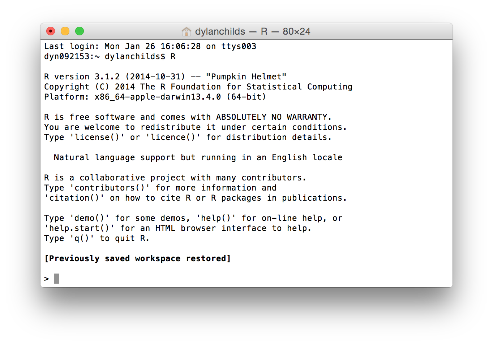

```{r include=FALSE}
# automatically create a bib database for R packages
pckg_set <- c(.packages(), 'bookdown', 'knitr', 'rmarkdown', 'packages.bib', 'readr', 'dplyr', 'ggplot2', "cowplot", "hexbin", "nasaweather", "palmerpenguins")
knitr::write_bib(pckg_set)

# packages we'll use
library("dplyr")
library("ggplot2")
library("nasaweather")
library("magrittr")
library("knitr")
library("hexbin")
library("cowplot")

# knitr options
opts_chunk$set(fig.width=3.5, fig.height=3.5, fig.align="center")

# data
penguins <- 
  palmerpenguins::penguins %>%
  mutate(across(where(is.factor), as.character))

# Set plotting to bw plot default, but with transparent background 
# elements. Note transparency requires the panel.background, 
# plot.background, and device background all be set!
theme_update(
  plot.background = element_rect(fill = "transparent", colour = NA)
)
```

# What you will learn {.unnumbered}

This book provides a self-contained introduction to how to use R for exploratory data analysis. Think of it as a resource to be referred to when needed. There is no need to memorise everything in this book. Instead, aim to understand the key concepts and familiarise yourself with the content, so that you know where to look for information when you need it. The details will get easier with practise.

## Aims {.unnumbered}

This book has three related aims:

1.  Introduce the R ecosystem. R is widely used by biologists and environmental scientists to manipulate and clean data, produce high quality figures, and carry out statistical analyses. We will teach you some basic R programming so that you are in a position to address these needs in future if you need to. You don't have to become an expert programmer to have a successful career in biology but knowing a little bit of programming has almost become a prerequisite for doing research in the 21^st^ century.

2.  Demonstrate how to use R to carry out data manipulation and visualisation. Designing good experiments, collecting data, and analysis are hard, and these activities often take a great deal time and money. If you want to effectively communicate your hard-won results, it is difficult to beat a good figure or diagram; conversely, if you want to be ignored, put everything into a boring table. R is really good at producing figures, so even if you end up just using it as a platform for visualising data, your time hasn't been wasted.

3.  Provides a foundation for learning statistics later on. If you want to be a biologist, particularly one involved in research, there is really no way to avoid using statistics. You might be able to dodge it by becoming a theoretician, but if that really is your primary interest you should probably being studying for a mathematics degree. For the rest of us who collect and analyse data knowing about statistics is essential: it allows us to distinguish between real patterns (the "signal") and chance variation (the "noise").

## Topics {.unnumbered}

The topics we will cover are divided into three 'blocks':

The **Getting Started with R** block introduces the R language and the RStudio environment. The aim is to quickly run through what you need to know to start using R productively. This includes some basic terminology, how to use R packages, and how to access help. We are not trying to turn you into an expert programmer---though you may be surprised to discover that you do enjoy it. However, by the end of this block you will know enough about R to begin learning the practical material that follows.

The **Data Wrangling** block aims to show you how to manipulate data with R. If you regularly work with data a large amount of time will inevitably be spent getting data into the format you need. The informal name for this is 'data wrangling'. This topic that is often not taught to beginners, which is a shame because mastering the art of data wrangling saves time in the long run. We'll learn how to get data into and out of R, makes subsets of important variables, create new variables, summarise your data, and so on.

The **Exploratory Data Analysis** block is all about using R to help you understand and describe your data. The first step in any analysis after you have managed to wrangle the data into shape should involve some kind of visualisation or numerical summary. You will learn how to do this using one of the best plotting systems in R: **ggplot2**. We will review the different kinds of 'variables' you might have to analyse, discuss the different ways you can describe them, and then learn how to explore relationships between variables.

## Technologies {.unnumbered}

### What is R? {.unnumbered}

The answer to this question very much depends on who you ask. We could go on and on about the various features that R possesses. R is a functional programming language, it supports object orientation, etc etc... but these kinds of explanations are only helpful to someone who already knows about computer languages. Here's what you need to know... When a typical R user talks about "R" they are often referring to two things at once, the GNU R language and the ecosystem that exists around the language:

-   R is all about **data analysis**. We can carry out any standard statistical analysis in R, as well as access a huge array of more sophisticated tools with impressive names like "structural equation model", "random forests" and "penalized regression". These days, when statisticians and computer scientists develop a new analysis tool, they often implement it in R first. This means a competent R user can always access the latest, cutting edge analysis tools. R also has the best graphics and plotting facilities of any platform. With sufficient expertise, we can make pretty much any type of figure we need (e.g. scatter plots, phylogenetic trees, spatial maps, or even [volcanoes](http://www.r-project.org/screenshots/volcano-image.jpg)). In short, R is a very productive environment for doing data analysis.

-   Because R is such a good environment for data analysis, a very large **community of users** has grown up around it. The size of this community has increased steadily since R was created, but this growth has really increased up in the last 5-10 years or so. In the early 2000s there were very few books about R and the main way to access help online was through the widely-feared R mailing lists. Now, there are probably hundreds of books about different aspects of R, online tutorials written by enthusiasts, and many websites that exist solely to help people learn R. The resulting ecosystem is vast, and though it can be difficult to navigate at times, when we run into an R-related problem the chances are that the answer is already written down somewhere[^index-1].

[^index-1]: The other big change is that R is finally starting to become part of the commercial landscape---learning how to use it can only improve your job prospects.

R is not just about data analysis. R is a fully-fledged programming language, meaning that once you become proficient with it you can do things such as construct numerical simulation models, solve equations, query websites, send emails or carry out many other tasks we don't have time to write down. We won't do any of this year or next but it is worth noting that R can do much more than just analyse data if we need it to.

### What is RStudio? {.unnumbered}

R is essentially just a computer program that sits there and waits for instructions in the form of text. Those instructions can be typed in by a user or they can be sent to it from another program. R also runs in a variety of different environments. The job of RStudio is to provide an environment that makes R a more pleasant and productive tool.

::: {.infobox .warning data-latex="{warning}"}
#### R and RStudio are not the same thing. {.unnumbered}

RStudio is a different program from R---it is installed separately and occupies its own place in the Programs menu (Windows PC) or Applications folder (Mac). We can run R without RStudio if we need to, but we cannot run RStudio without R. Remember that!
:::

One way to get a sense of why RStudio is a Very Good Thing is to look at what running R without it is like. The simplest way to run it on a Linux or Unix-based machine (like a Mac) is to use something called the Terminal. It's well beyond the scope of this book to get into what this is, but in a nutshell, the Terminal provides a low-level, text-based way to interact with a computer. Here is what R looks like running inside a Terminal on a Mac:

```{r, echo=FALSE}

```

We can run R in much the same way on Windows using the "Command Prompt" if we need to. The key thing you need to take away from that screenshot is that running R like this is very "bare bones". We typed the letter "R" in the Terminal and hit Enter to start R. It printed a little information as it started up and then presented us with "the prompt" (`>`), waiting for input. This is where we type or paste in instructions telling R what to do. There is no other way to interact with it when we run R like this -- no menus or buttons, just a lonely prompt waiting for instructions.

So what is RStudio? In one sense RStudio is just another Graphical User Interface for R which improves on the "bare bones" experience. However, it is a GUI on steroids. It is more accurate to describe it as an [Integrated Development Environment](http://en.wikipedia.org/wiki/Integrated_development_environment) (IDE). There is no all-encompassing definition of an IDE, but they all exist to make programmer's lives easier by integrating various useful tools into a single piece of software. From the perspective of this book, there are four key features that we care about:

-   The R interpreter---the thing that was running in the Terminal above---runs inside RStudio. It's accessed via a window labelled Console. This is where we type in instructions we want to execute when we are working directly with R. The Console also shows us any output that R prints in response to these instructions. So if we just want the "bare bones" experience, we can still have it.

-   RStudio provides facilities for working with R programs using something called a Source Code Editor. An R program ( also called a "script")" is just is a collection of instructions in the R language that have been saved to a text file. Nothing more! However, it is much easier to work with a script using a proper Source Code Editor than an ordinary text editor like Notepad.

-   An good IDE like RStudio also gives you a visual, point-and-click means of accessing various language-specific features. This is a bit difficult to explain until we have have actually used some of these, but trust us, being able to do things like manage packages, set working directories, or inspect objects we've made simplifies day-to-day use of R. This especially true for new users.

-   RStudio is cross-platform---it will run on a Windows PC, a Linux PC or a Mac. In terms of the appearance and the functionality it provides, RStudio is exactly the same on each of these platforms. If we learn to work with R via RStudio on a Windows PC, it's no problem migrating to a Mac or Linux PC later on if we need to. This is a big advantage for those of us who work on multiple platforms.

We'll only scratch the surface of what RStudio can do. The reason for introducing a powerful tool like RStudio is because one day you may need to access sophisticated features like debugging facilities, package build tools, and repository management. RStudio makes it easy to use these advanced tools.
